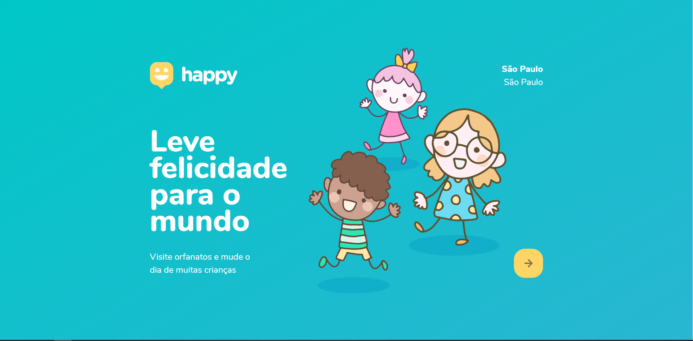
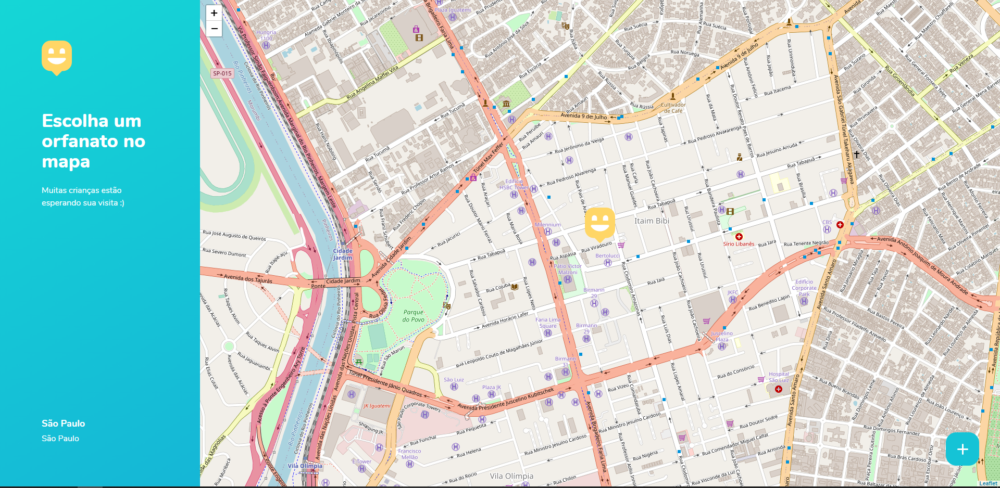
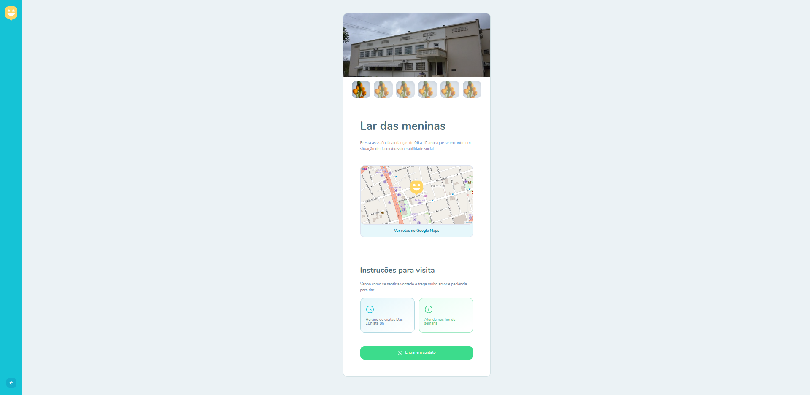
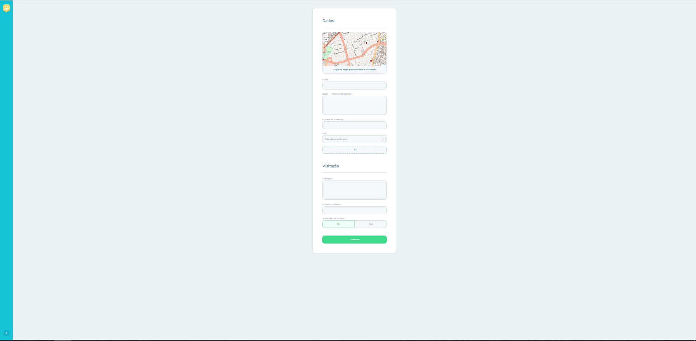

<h1 align="center">
    
    
Happy

     
    
    
</h1>

## Sobre o Projeto 

O projeto Happy é um aplicativo que tem como objetivo aproximar a população e os orfanatos na região, levando assim mais felicidade as crianças dessas instituições. Esse projeto foi desenvolvido durante a NLW-3(Next Level  Week) realizado pela RocketSeat

### Features

- Cadastro de orfanatos
- Consulta de orfanatos

## Layouts

## 🛠 Tecnologias

As seguintes ferramentas foram usadas na construção do projeto:

- [HTML](https://www.w3.org/html/)
- [CSS](https://www.w3.org/Style/CSS/)
- [JavaScript](https://documentation.js.org/)

## Autor

Jefferson D'Antonio Malaquias 

 

<h4 align="center"> 
	🚧  Happy 🚀 Em construção...  🚧
</h4>